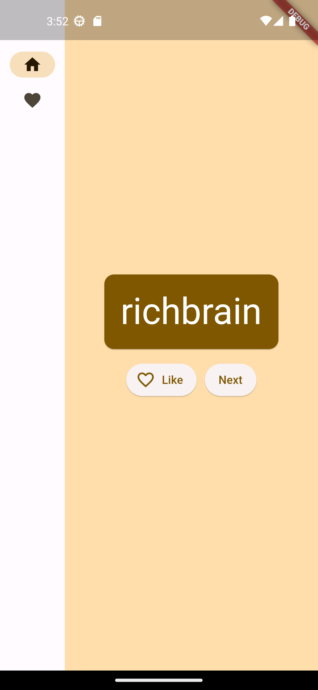
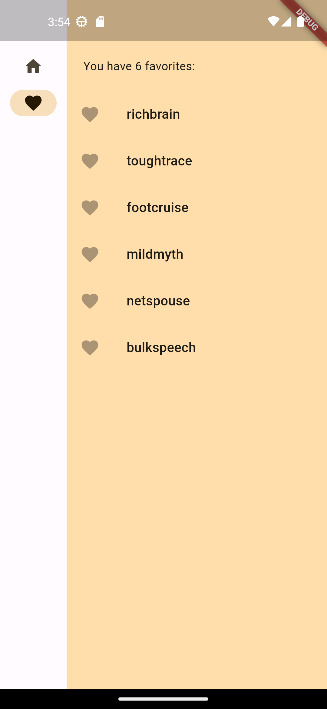

# Word Pair

A beginner Flutter project covering the basics of State & Widgets.

## Features

The app has two screens: "Home" and "Favorites".  

Home shows a combination of two common English words, forming a WordPair.

You can favorite any catchy/interesting wordpairs to check them out later by clicking the "Like" button.

Favorites allows you to check out all the interesting wordpairs that you've come across in the Home screen.